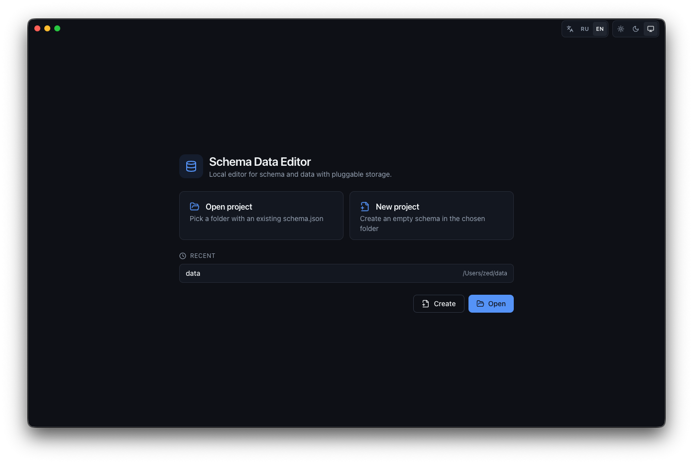
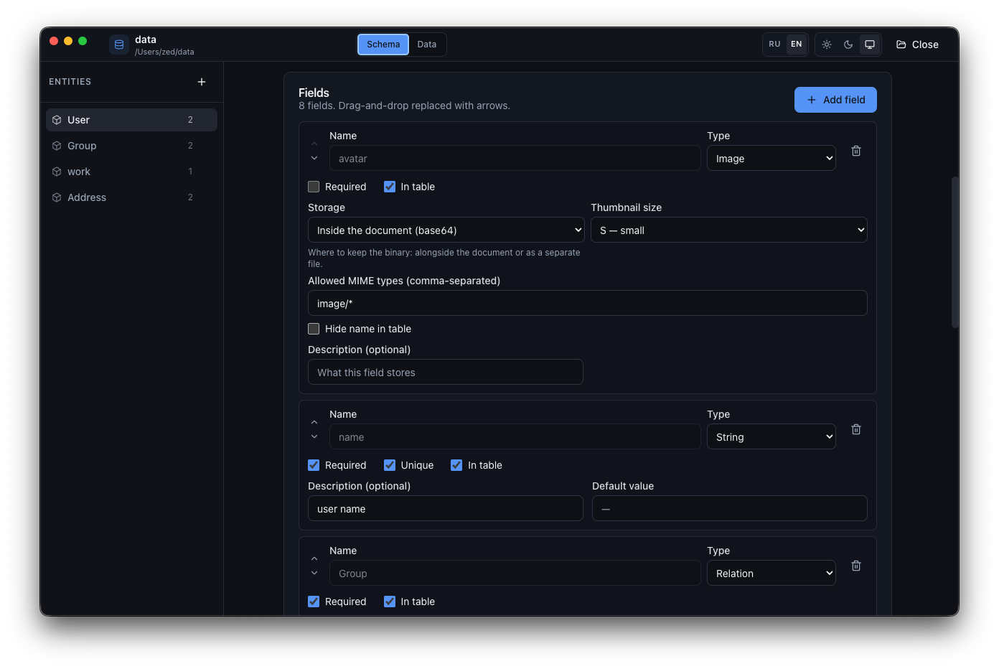
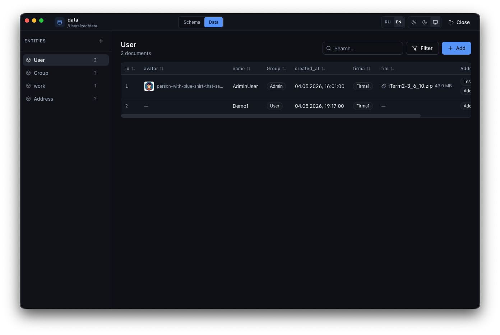

# Schema Data Editor

A local desktop utility for editing a JSON schema and its data with relations.
Built with Electron + Vite + React + TypeScript. Designed for small,
file-based datasets you want to keep under version control alongside code.



## Screenshots

Schema editor — entities, fields, per-field options (storage, validations,
defaults, descriptions):



Data view — table with per-column filters, tri-state sort, search, image
thumbnails and attachment links:



## What it does

You point the app at a folder. It writes a `schema.json` describing your
entities (fields, types, relations, IDs) and stores the documents in the
same folder using one of three layouts.

- **Multi-entity schema.** Define as many entities as you need. Each entity
  has its own ID strategy (`auto-increment` number or `uuid` v4) and a
  display field used in lists and relation pickers.
- **Field types.** `string`, `text` (long), `number`, `boolean`, `date`,
  `datetime`, `enum`, `relation` (one or many), `file`, `image`.
- **Pluggable storage.** Pick where the data goes:
  - `single-json` — everything in one `data/data.json`.
  - `file-per-collection` — `data/User.json`, `data/Post.json`, …
  - `file-per-doc` — `data/User/<id>.json`, `data/Post/<id>.json`, …
  Format changes migrate the existing data automatically.
- **Attachments (file/image).** Stored either inline as base64 inside the
  document or as separate files under `<dataDir>/_attachments/<entity>/<id>/`.
  Old files are cleaned up on replace/delete.
- **Relations.** One-to-one and one-to-many via ID arrays, with pickers that
  show the target's display field.
- **List view.** Per-column filters (substring, number with operators, enum
  select, boolean, date, relation), tri-state column sort, full-text search,
  per-field "show in table" toggle, image cells with hover preview at S / M /
  B sizes.
- **Light / dark / system theme.**
- **Russian / English UI.** Persisted choice; native folder dialogs are
  localised through IPC.

## Quickstart

Requirements: Node 20+ and npm.

```bash
npm install
npm run dev       # launches Electron with HMR
```

Other useful commands:

```bash
npm run build     # production bundle (out/{main,preload,renderer})
npm start         # run the production bundle
npm run typecheck # tsc --noEmit across all 3 tsconfigs
npm run dist      # produce installer for current OS via electron-builder
npm run dist:mac  # / dist:win / dist:linux
```

A storage smoke test (no Electron needed) is provided:

```bash
node --experimental-strip-types --no-warnings scripts/smoke-storage.mts
```

It exercises every storage format, format migration, attachment
read/write/delete, and `dataDir` migration with attachments preserved.

## Project layout on disk

After you create or open a project at `~/projects/myapp/`, the folder looks
like this (example with `file-per-collection` and an avatar attachment):

```
myapp/
├── schema.json
└── data/
    ├── User.json
    ├── Post.json
    └── _attachments/
        └── User/
            └── 1/
                └── avatar__photo.jpg
```

`schema.json` shape (abridged):

```json
{
  "version": 1,
  "storage": { "format": "file-per-collection", "dataDir": "data" },
  "defaultIdStrategy": "auto-increment",
  "entityOrder": ["User", "Post"],
  "entities": {
    "User": {
      "name": "User",
      "idStrategy": "auto-increment",
      "displayField": "name",
      "fieldOrder": ["name", "avatar", "manager"],
      "fields": {
        "name":    { "type": "string", "required": true },
        "avatar":  { "type": "image", "storage": "external", "thumbnailSize": "m" },
        "manager": { "type": "relation", "target": "User", "kind": "one" }
      },
      "nextId": 12
    }
  }
}
```

A document with an external image attachment looks like:

```json
{
  "id": 1,
  "name": "Alice",
  "avatar": {
    "name": "photo.jpg",
    "size": 184502,
    "mime": "image/jpeg",
    "path": "_attachments/User/1/avatar__photo.jpg"
  },
  "manager": null
}
```

## Stack

- **Electron 31** (ESM main + preload).
- **electron-vite** for the dev/build pipeline.
- **React 18 + TypeScript 5 + Vite 5**.
- **Tailwind CSS 3** with shadcn-style CSS-variable theming.
- **zustand** for renderer state.
- **lucide-react** icons.
- **uuid** for v4 IDs.

No Radix or other UI dependencies; primitives (`Button`, `Input`, `Dialog`,
`Card`, …) are hand-rolled in `src/renderer/src/components/ui/`.

## Constraints / what's intentionally not implemented

- Renaming an entity or field is not supported. Delete and recreate, or
  edit `schema.json` and the data files manually.
- Schema versioning beyond `version: 1` is a placeholder; no migration
  framework yet.
- Attachments use base64 over IPC. Soft cap of 50 MB per file in the form
  to keep things responsive.
